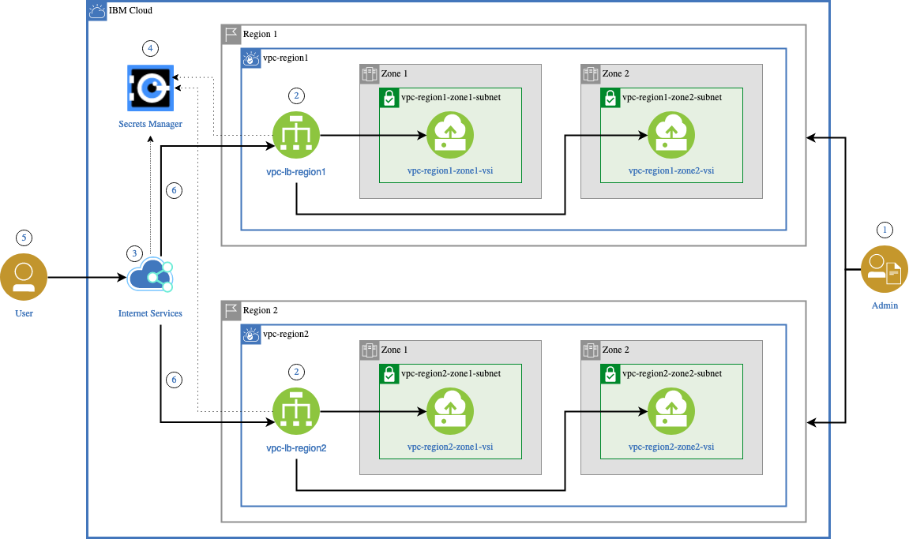

---

copyright:
  years: 2023
lastupdated: "2023-12-12"

subcollection: whitepaper-vpc-resiliency

keywords:

---

# Networking design
{: #networking-design}

IBM Cloud Virtual Private Cloud infrastructure and network services support multi-zone and multi-region deployment architectures for high availability and disaster recovery.

VPC Load balancers are used to distribute traffic across multiple zones within a region and support highly available configurations. There are two types of VPC Load Balancers:

-   Application Load Balancers (ALB): provide layer 4 and layer 7 load balancing, support SSL offloading and are recommended for web-based workloads.

-   Network Load Balancers: provide layer 4 load balancing and supports Source IP Preservation and Direct Server Return. It is recommended for workloads that require low latency and high data throughput.

The following table shows a comparison of these Load Balancers.

| **Category**                 | **Network Load Balancer (NLB)**                                                                                                                                                                                                                 | **Application Load Balancer (ALB)**                                                                                                        |
|------------------------------|-------------------------------------------------------------------------------------------------------------------------------------------------------------------------------------------------------------------------------------------------|--------------------------------------------------------------------------------------------------------------------------------------------|
| **Features**                 | - Layer 4 load balancing \n - VNF routing \n - TCP and UDP support \n - Direct Server Return (DSR) \n - Source IP Preserved                                                                                                                                 | - Layer 4 and 7 load balancing \n - Policy-based routing \n - HTTP, HTTPS, TCP support \n - SSL offloading \n - Source IP Preserved (proxy)            |
| **Recommended Use**          | Workloads that require low latency & high data throughput                                                                                                                                                                                       | Web-based workloads                                                                                                                        |
| **HA mode**                  | Active-standby (w/ single VIP)                                                                                                                                                                                                                  | Active-active (w/ multiple VIPs assigned to a DNS name)                                                                                    |
| **Instance group support**   | Yes (see [Integrating NLB for VPC with instance groups](https://cloud.ibm.com/docs/vpc?topic=vpc-nlb-integration-with-instance-groups))                                                                                                         | Yes (see [Integrating ALB for VPC with instance groups](https://cloud.ibm.com/docs/vpc?topic=vpc-lbaas-integration-with-instance-groups))  |
| **Monitoring metrics**       | Yes                                                                                                                                                                                                                                             | Yes                                                                                                                                        |
| **Multi-zone support**       | Accepts members across all three availability zones. Deploy in each zone along with Global Load Balancer for multi-zone availability (see [Multi-zone support](https://cloud.ibm.com/docs/vpc?topic=vpc-network-load-balancers#nlb-use-case-2)) | Yes. Deploy in region and configure subnets across availability zones.                                                                     |
| **Security group support**   | No                                                                                                                                                                                                                                              | Yes (see [Integrating an ALB for VPC with security groups](https://cloud.ibm.com/docs/vpc?topic=vpc-alb-integration-with-security-groups)) |
| **Source IP preserved**      | Yes                                                                                                                                                                                                                                             | Yes ([with proxy protocol](https://cloud.ibm.com/docs/vpc?topic=vpc-advanced-traffic-management#preserving-end-client-ip-address))         |
| **SSL offloading**           | No                                                                                                                                                                                                                                              | Yes                                                                                                                                        |
| **Types of load balancers**  | Public and private                                                                                                                                                                                                                              | Public and private                                                                                                                         |
| **Virtual IP Address (VIP)** | Single                                                                                                                                                                                                                                          | Multiple                                                                                                                                   |
| **Route mode for VNFs**      | Yes (see [Setting up high availability for Virtual Network Functions (VNF)](https://cloud.ibm.com/docs/vpc?topic=vpc-about-vnf))                                                                                                                | No                                                                                                                                         |
| **Member type**              | Virtual server instances                                                                                                                                                                                                                        | Virtual server instances, Bare Metal, Power Systems Virtual Server                                                                         |
{: caption="Table 1. Comparison of VPC Load Balancers" caption-side="bottom"}

The Cloud Internet Service (CIS) provides a Global Load Balancer that can distribute traffic on the public network across availability zones within a region in a multi-zone deployment or across multiple regions in a multi-region deployment.

In active-active DR deployments, use IBM Cloud Internet Services (CIS) to reduce network latency for application users in different geographies. Define location-based pools and configure CIS to redirect users to the closest VPC load balancer based on the geographical location of the user requests.

CIS can also be configured as a proxy to a VPC Application Load Balancer in multi-zone or multi-region deployments to leverage CIS application security capabilities such as Web Application Firewall (WAF) and DDoS protection. See [Proxying DNS records and global load balancers](https://cloud.ibm.com/docs/cis?topic=cis-dns-concepts#dns-concepts-proxying-dns-records) for details.

{: caption="Figure 1. Cloud Internet Services (CIS) proxy for VPC load balancers" caption-side="bottom"}
