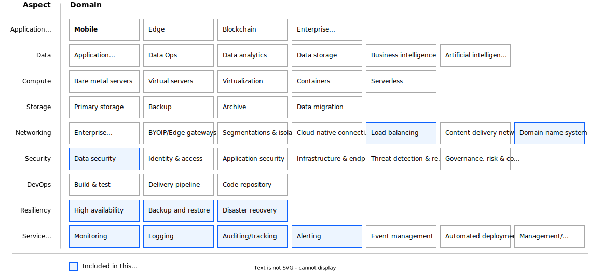

---

copyright:
  years: 2023
lastupdated: "2023-12-14"

subcollection: vpc-resiliency

keywords:

---

{{site.data.keyword.attribute-definition-list}}

# VPC Resiliency Overview
{: #overview}

High Availability and Disaster Recovery are important considerations to meet continuous business operations and resiliency requirements for enterprise workloads.

High availability solutions are designed to minimize down time under normal operations. Disaster recovery solutions are designed to minimize down time in the event of unplanned outages, whatever the cause.

Cloud platforms are intrinsically built to tolerate failures and provide features to help build reliable and highly available solutions such as: 1. elastic compute and storage at various geographic locations, 2. availability zones engineered to be isolated from failures in other zones, and 3. highly available cloud services deployed across multiple zones or regions, e.g. object storage, Database as a service. However, just moving an application to the cloud does not make it fault-tolerant or highly available. Application resiliency in public clouds is a shared responsibility. To build resilient applications in the cloud you must:
- Design applications for availability and recoverability, e.g. applications are
    - built to scale using modern design practices and microservices architecture for scalability and portability.
    - built for resiliency using highly available patterns.
    - DevOps-enabled to support automated provisioning and continuous integration and delivery (CI/CD).
    - Infrastructure as Code (IaC) enabled for automated provisioning and configuration management.
- Leverage platform and infrastructure deployment patterns for high availability and disaster recovery.
- Use data replication and backups to protect the data and support failover and disaster recovery.
- Implement Operations Management strategy to support availability targets, e.g.
   - establish DevOps process and toolchain for continuous integration / continuous delivery, GitOps enabled for Day 2 operations and procedures.
   - monitor the application and platform infrastructure to detect failures and degradations.
   - setup alerts and operations to automate problem resolution and enable a timely response to incidents.

Following the [Architecture Framework](https://cloud.ibm.com/docs/architecture-framework?topic=architecture-framework-intro)\*, this document provides design considerations and architecture decisions for deploying resilient applications on IBM Cloud Virtual Private Cloud (VPC) infrastructure. It covers the following solution aspects and domains:
- **Networking:** Load Balancing, DNS
- **Security:** Data Security
- **Resiliency:** High Availability, Backup and Restore
- **Service Management:** Monitoring, Logging, Auditing, Alerting

{: caption="Figure 1. VPC Resiliency Architecture Design Scope" caption-side="bottom"}

The Architecture Framework provides a consistent approach to design cloud solutions by addressing requirements across a set of "aspects" and "domains", which are technology-agnostic architectural areas that need to be considered for any enterprise solution. For more details, see [Introduction to the Architecture Framework](/docs/architecture-framework).
